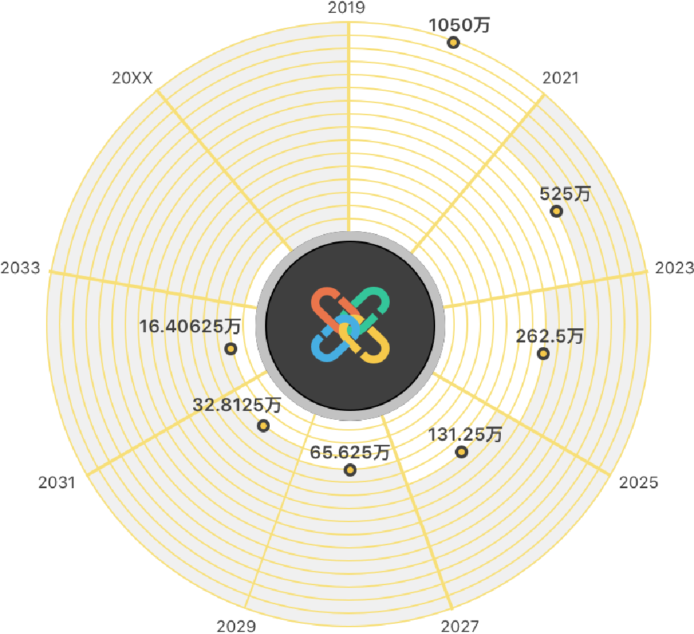
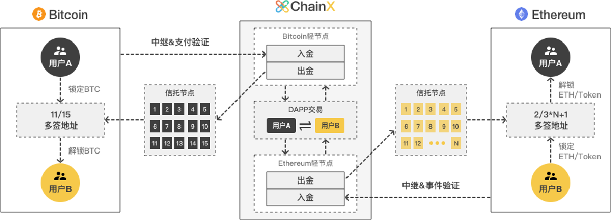
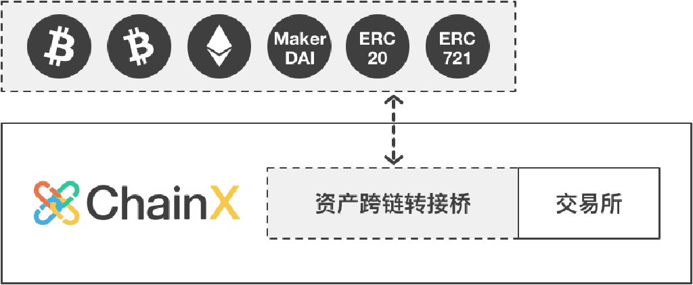
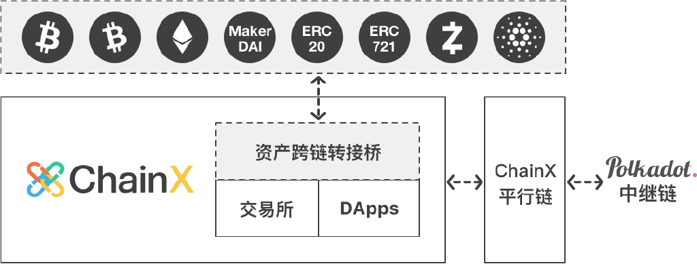
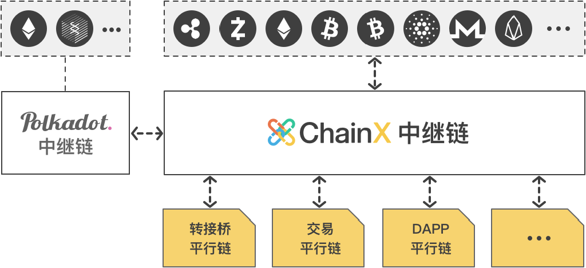

<h1 align="center">ChainX 白皮书</h1>

2019-07-26

数字资产的跨链枢纽

打破链间资产壁垒，实现多币种融合的公链生态

## 背景

>目前区块链系统的资产被困于自己的系统内，无法产生链间分工和协作

BTC 建立了最大范围共识，却交易效率低下；ZEC 建立了隐私功能，却没有智能合约能力；ETH 建立了智能合约，却无法迁移至 PoS 系统；ChainX 通过去中心化的的方式将链间资产进行统一转化，任何链只要建立与 ChainX 的连接，就可以与所有链进行资产互通。

区块链行业中的 PoW 算法根据算力大小发行新币，被认为是比较去中心化和公平的发行模式，但仍然会被大型显卡或矿机厂商垄断，普通用户只能高价购买矿机。 PoS 链一般采用私募方式进行大量的一次性预
挖发行，或设立中心化基金主观发行，上线后一般只面向投票用户进行少量增发，导致新用户只能在二级市场高位接盘入场。

PoW 世界挖矿权力的衡量标准是算力，One CPU One Vote。 传统 PoS 世界挖矿权力的衡量标准是币量，One Coin One Vote，这里的 Coin 指的是经过初始发行后的存量 Coin，新的 Coin 发行给存量 Coin
选举产生的节点，已经造成了群体固化。PoW 的 CPU 可以源源不断地涌入进来挖矿，而 PoS 的 Coin 却没有持续的公平产生规则，引入了过多的中心化干涉因素。

EOS 是新型 PoS 链的代表，虽然没有采用私募一次性预挖的方式，而是在以太坊链上线前进行长达一年的公开 ICO，通过 ETH 的价值产生 EOS，但等到链真正上线，产生实际运行效果以后，新币的增发已经被存量币选举产生的节点垄断，新的制衡力量无法继续涌入，去中心化理念无法达成。 去中心化系统道阻且长，一年的公开发行还是会过早结束公开博弈，比特币思想的百年竞争才会活水不断。

## 概述

>ChainX 的 PoS 共识首创了 One Asset One Vote 的资产挖矿模式，根据用户跨链充值进来的 BTC、ETH、EOS 等多种资产的市值衡量挖矿权重，沿用比特币从零开始逐步减半的模式发行新币，公平分配系统发行的 PCX

用户可以将自己持有的各类数字资产跨链接入ChainX，系统集成的交易所 DApp 一方面可以满足这些资产交易需求，同时也产生公允价格进行挖矿市值统计。

Polkadot 是 Web3 基金会发起的项目，由以太坊前 CTO Gavin Wood 主导的 Parity 团队进行设计和开发。 Polkadot 致力于实现链间任意消息通信，将解决区块链的互通性问题，进而实现多链并存，解决扩展性和多样性问题。 Polkadot 开发了通用的基础链框架 Substrate，实现了混合 PoS 共识、链上议会治理、Wasm 虚拟机、智能合约原生执行、高效轻客户端协议等。 目前包括以太坊 2.0 的 Shasper 也正在此框架上实现。

Web3 基金会与 ChainX 达成了战略合作伙伴关系，ChainX 将使用 Polkadot 的 PoS 共识和合约技术，专注于提供资产跨链的上层设施，而 Polkadot 将致力于更通用的跨链任意消息通信，专注于提供信息跨链
的底层设施。 ChainX 将首先上线开始跨链整合现有的数字资产，来为 Polkadot 生态做预热，等 Polkadot 上线时，就就能够将现有链的资产往 Polkadot 网络输送，同时能够将 Polkadot 网络内的新资产提供各种服务。

ChainX 将尽量采用最去中心化的轻节点方式，跨链整合主流数字资产，包括 BTC、ETH、ERC20、EOS、ADA、ZEC 等，培养社区进行跨链资产转账的习惯和开发者生态，并孵化采用最新智能合约技术的 DApp。Substrate 只提供了最基础的链模型，而且在持续演变之中，ChainX 仍需要在 Substrate 上进行大量开发才能满足上述需求，包括多链的轻节点转接桥、见证人转接桥、特殊的经济激励模型、多链资产托管工具、多平台钱包、区块链浏览器等。

## 经济系统

#### 发行模式

    

ChainX将发行加密货币PCX（P代表Polkadot），总量2100万枚，每两年减半，前两年发行量的20%归创始团队所有，用于持续性的开发经费。两年后发行量将全部归社区所有，创始团队将只占总量的10%。Bitcoin的每个块为10分钟，初始单块奖励为50BTC，每21万个块减半。ChainX的每个挖矿周期为5分钟，初始单周期奖励为50PCX，每21万个周期减半。

#### 资产挖矿

资产挖矿的所有参与方以PCX为算力单位进行竞争，分为虚拟算力的跨链挖矿和真实算力的投票选举挖矿:

- 跨链挖矿指跨链用户通过充值, 映射或锁仓等方式进入的各类链外资产，比如BTC、ETH等，将自动根据该跨链资产兑换PCX的价格和相应的跨链资产折扣D折合成虚拟的PCX跨链挖矿算力。每个跨链资产都有不同的跨链资产折扣, 跨链资产折扣的参数可通过社区投票调整。之所以会有跨链资产折扣，是因为PCX作为系统原生货币，理应比跨链资产获得更大的挖矿权重，鼓励用户更多地持有PCX。

- 投票挖矿指用户所持有的真实PCX参与PoS系统的选举手动投票给某些节点。

用户的总挖矿算力为虚拟PCX的跨链挖矿算力和真实PCX的投票挖矿算力之和。比如用户跨链充值了1个BTC、2个ETH进入ChainX，并持有700个PCX，其中有300个PCX参与了选举投票，400个PCX未参与投票。此时ChainX内交易所撮合产生过去一小时均价为1BTC:10000PCX，1ETH:1000PCX，则用户将自动获得（1 * 10000 + 2 * 1000）* 10% + 300 = 1500PCX 的挖矿算力。所有用户根据挖矿总算力瓜分每个奖励周期的PCX挖矿收益，所获PCX可以继续参与选举投票，也可以等待所持有的跨链资产升值，来获得更大的挖矿权重。

尽管用户持有的链外资产可以获得公平挖矿的权力，但由于资产市值在不断波动，只有挖矿产生的PCX数量才是稳定的，故只有PCX才能做作为节点选举和链上治理的唯一衡量标准。

#### 动态挖矿

ChainX作为一个PoS系统，其安全性依托于用户抵押的PCX，抵押的PCX越多，系统越安全。同时由于ChainX致力于成为跨链资产网关的特性，其另一个价值支撑点在于所连接的跨链资产，接入的跨链资产越多
，价值越大。此外，由于原生资产与跨链资产竞争性地共同参与资产挖矿，因此两者是一个相互依存又相互竞争的关系。为了避免在系统初期跨链资产短时间内大量涌入对系统造成冲击，原生资产与跨链资产挖矿采用动态挖矿模型，当跨链资产增速太快时，采用固定分红比例对跨链资产和原生资产进行分配。

当前跨链资产与PCX投票挖矿算力上限比例为1:1, 该比例可由社区投票调整，即所有跨链资产的挖矿算力上限设定为50%，保证PCX投票挖矿的算力占比大于等于50%，每天至少有一半的PCX会发行给PCX持有者。

##### 符号表

符号                      | 意义
:--                       | :--
Powertotal     | 全网挖矿总算力
Powerreal      | 全网真实挖矿算力
Powervirtual   | 全网虚拟挖矿算力
Rtotal         | 每个分红周期所有算力瓜分的发行总量
Rreal          | 每个分红周期全网真实算力分得的PCX总量
Rvirtual       | 每个分红周期全网虚拟算力分得的PCX总量
Staked                    | 全网参与投票选举的PCX总数
c                         | 某一跨链资产, c ∈ { X-BTC, L-BTC, S-DOT, ... }
Powerc         | 跨链资产 c 的总虚拟算力
Amountc        | 跨链资产 c 的总量,
Pricec         | 单位跨链资产 c 兑换PCX的价格
Discountc      | 跨链资产 c 单资产初始折扣
UbiquitousDiscount        | 所有跨链资产动态竞争折扣
FinalDiscountc | 跨链资产 c 的最终算力折扣

##### 算力相关计算公式

- 全网算力等于全网真实算力与全网虚拟算力之和：

    Powertotal = Powerreal + Powervirtual

- 全网真实算力等于全网投票总数:

    Powerreal = Staked

- 全网虚拟算力为各跨链资产对应的虚拟算力之和：

    Powervirtual = sum ( Powerc ), c ∈ { X-BTC, L-BTC, S-DOT, ... }

- 单跨链资产 c 的虚拟算力等于以PCX为单位的资产市值乘以对应的初始挖矿折扣:

    Powerc = Amountc * Pricec * Discountc 

    对于 c ∈ { X-BTC, L-BTC }:

    - Price X-BTC  基于链上DEX过去一小时的成交均价计算

    - Discount X-BTC 目前为10%

    - L-BTC 没有交易对，目前算力与X-BTC算力相同。

    对于 c ∈ { S-DOT }:

    - Price S-DOT 为固定的 0.1PCX

    - Discount S-DOT 为10%。

- 每个分红周期所有算力的发行总量分配:

    Rtotal = Rreal + Rvirtual

- 基于市值的跨链资产 c 最终算力折扣:

    FinalDiscountc = Discountc * UbiquitousDiscount

##### 动态算力竞争

当前所有跨链资产挖矿算力比上限为 50%, 即 Powervirtual : Powerreal = 1:1。若 Powervirtual > Powerreal, 则上限挖矿算力规则生效。

- 当 Powervirtual <= Powerreal 时，

    - Rreal    = Powerreal / Powertotal * Rtotal

    - Rvirtual = Powervirtual / Powertotal * Rtotal

    - UbiquitousDiscount = 1

- 当 Powervirtual > Powerreal 时,

    - Rreal     = 1/(1+1) * Rtotal = 50% * Rtotal

    - Rvirtual = 1/(1+1) * Rtotal = 50% * Rtotal

    - UbiquitousDiscount = Powerreal / Powervirtual

按照跨链资产与投票资产动态算出两类资产总奖励以后，根据各真实和虚拟节点在所在类别的比例得出单个节点的奖励, 进而根据票龄算出单用户收益。当所有跨链资产总数激增达到上限后，相当于每个跨链资产始终有一个单资产折扣的情况下，再施加一个所有跨链资产总折扣。

ChainX主网于2019年5月25日正式启动，目前已支持BTC充值(X-BTC)和锁仓挖矿(L-BTC)以及DOT映射挖矿(S-DOT)，其余主流资产的支持将等待各链转接桥开发完善后陆续上线。

DOT投资者在Polkadot上的币并不能转账，通过跨链映射进入ChainX系统的币只有PCX挖矿权，并不是真正的DOT，为了便于区分，起名为S-DOT. 通过锁仓进入的L-BTC同样只有ChainX系统内的挖矿权，不可转账。

链上的去中心化交易所DApp已开通的交易对有PCX/X-BTC 和 S-DOT/PCX，其中X-BTC代表真正的BTC，在信托节点多签托管的地址中有足额的储备，可以随时支持用户的提现操作。SDOT代表在DOT上线前使用DOT的预期估值，在ChainX内进行跨链挖矿的权力，DOT投资者可以随时通过跨链映射证明自己的投资数量，该资产无需提现，在Polkadot上线前可以一直参与挖矿。

## 共识算法

ChainX 将使用波卡的 PoS 共识算法，将建立史上最大规模的 PoS 节点网络，能够支持 1000 个共识节点，2s 的出块时间，10s 以内的最终确定性延迟

传统的 PoW 算法，单个矿机的算力很弱，无法独立出块，只能选择加入矿池或自建矿池，造成每条链只有数 10 个矿池节点。 初代 PoS 链一般是 7 个节点左右，后来的 PoS 链也最多只有几十个节点。 区块链网络的去中心化特性一直没有发挥出来，普通用户无法直接成为共识节点，只能依附于大机构，掌握不了系统记账权。

ChainX 的共识节点的数目限制将从几十个起步，待社区培养成熟后逐步放大限制。 起始阶段需要使用云服务器搭建共识节点，后期普通用户只需下载桌面钱包就可以出块，但需要保持持续良好的网络接入环境和计算能力，否则出块如果延迟将受到惩罚，一般情况下的良好的家用网络和高性能台式机就可以满足基本需求。 惩罚资金会转入议会基金，供后续的全民公投决定如何处理。

任何人都可以申请注册节点，并在节点服务器安装完毕后，开始参选。 ChainX采用一票一投的模式，杜绝节点串谋。 任何用户都可以使用PCX进行节点选举，推荐选择那些自抵押高、运行情况稳定、身份披露完全的节点。

节点的盈利模式是获得用户投票挖矿所得的10%，具体比例可以通过后续的全民公投形式修改。 节点的掉线或其他恶意行为将受到惩罚，将同时扣减节点自抵押和用户待领奖励。 每届共识节点的选举周期为一天，将根据总得票数排序。 未能选上共识节点的成为同步节点，也同样需要搭建真实的节点发送心跳交易，不能注册空节点。 由于共识节点和同步节点的得票都会同等地参与到挖矿奖励中，用户将获得同样的收益，这样就不会影响到同步节点的进阶。

## 转接桥

    

> 资产跨链的含义是，用户把资产在原链上锁定，之后在目标链上发行映射资产，同时可以在目标链上申请提现，最后在原链上解锁的过程

资产在原链上并没有消失，而是转由轻节点协议去中心化托管，或由单独的个人或多人中心化托管。 资产跨链映射一般分为见证人、哈希锁定和轻节点中继模式。 见证人系统需半中心化信任这些担保机构；哈希锁定直接转移资产所有权，无法进行跨链映射，交易可能中断。 真正实用和安全的去中心化跨链映射方案就是轻节点模式，跨链映射的安全性由原链的共识算法保证，是最高级别的安全性。 而如果原链集成不了目标链的轻节点，那原链资产只能由个人或多签托管，如果可以，则由目标链在原链上的轻节点协议托管。

对于拥有高效轻节点的链，ChainX 将采用轻节点协议完成往 ChainX 链的资产映射，但现有主流链一般无法集成 ChainX 链的轻节点，所以只能采用多签地址或多签合约联合托管用户的原链资产。初始信托节点由参与ChainX测试网的优秀节点担任，之后的每届信托采用禅让制度，由议会和上一届信托共同决定并执行。信托节点须生成冷热两个多签地址或合约，每次换届后，老地址的资金会转入新地址。用户可以实时查看系统的跨链资产发行和储备量，没有任何信托节点可以单方挪用。

目前我们已经开发完成了 BTC 的轻节点桥，可以完全去中心化映射 BTC 进入 ChainX。 ETH 的轻节点桥正在开发之中, 其他链的轻节点桥也正在对接之中，与 Polkadot 生态链的对接将采用双向轻节点协议，更加高效且无需信托节点托管。

## 跨链映射

> 跨链资产转账需要建立两条链上用户地址的映射关系，这样用户在原链的充值操作，系统才能为 ChainX 上相应的账户发行映射资产

跨链绑定的具体方法为：

用户需使用自己的原链账户向托管地址发起普通转账交易，在备注中填写 ChainX 的账户地址即可，这种由原链私钥签名确保的交易可以保证用户的资产在跨链后仍然在自己的控制之中。 跨链绑定做过一次，以后就可以直接转账了，无需在附加备注信息。 如需更换地址，可以重新携带备注信息，原链地址的绑定信息将会更新。

具体到 Bitcoin 的跨链绑定，备注指的是交易中的 OP_RETURN 功能；Ethereum 的跨链绑定，备注指的是交易中的 data 功能；EOS 跨链绑定，备注指的是 交 易 中 的 memo 功 能。 目 前 Bitcoin 钱 包 对
OP_RETURN 的支持较少，ChainX 开发了专用的离线绑定工具，各个 Bitcoin 钱包也可以开发便捷的跨链绑定工具。 目前 Ethereum 钱包对 data 的支持比较完善，一般用户都能找到高级选项的入口。 而 EOS
的 memo 支持则是非常普遍的，极易操作。

资产跨链的黎明已经来临，BTC钱包迟早需要为用户开启跨链绑定的功能。 在ChainX的激励规则内，钱包在提供绑定功能时，可以在备注中可以附加填写自己ChainX节点的名字，标识跨链绑定渠道。 在用户手工提取充值挖矿奖励时，会提取10%给绑定渠道账户，如果用户没有绑定渠道，10%将打给议会基金，具体比例可以通过后续的全民公投形式修改。

ChainX将根据各个链的用户数量和轻节点协议安排对接日程表，无偿提供上币服务。 也欢迎拥有完整轻节点协议的各链主动开发ChainX的转接桥，接入到ChainX系统中，也接入到整个跨链生态中。

## 账户系统

为了防止DDOS，用户在链上发送交易需要支付矿工手续费，系统会根据不同操作的复杂度扣除相应的手续费。 用户还可以根据网络拥堵情况，选择不同的加速倍数，实现灵活控制。 表面上用户需要支付手续费，但只要用户参与投票或拥有适量资产，在网络发展前期可以获得大量的挖矿收益，足以满足非高频用户在链上的交易需求。 并且共识节点打包时会将手续费再收集进去节点奖池，回补给投票用户。 所以投票用户仍然能够在这个闭环系统内“免费”使用区块链，并且大部分挖矿用户会处于盈利状态，只有某些高频交易用户需要额外支付手续费。

传统矿工费遭受诟病的地方在于过于昂贵，其昂贵并不是因为收费，而是因为链的吞吐量低。 EOS 表面上无需矿工手续费，实际使用资金成本却更高，而且遭到攻击风险更高

ChainX 目前发起一笔普通转账交易的手续费仅为0.0001PCX，随着 ChainX 的性能和吞吐量逐步提高，用户发起每笔操作的手续费将逐渐忽略不计。在网络发展后期，链的增发将逐步减慢，用户挖矿收益的主要来源是手续费收集和各类惩罚得来的资金。

PCX 主要有以下几种用途：

- 矿工费用: 用于支付矿工费用，类似于 BTC。

- 市值单位: 作为资产挖矿时的市值单位，所有资产根据兑 PCX 价格折合成投票，类似于 ETH/ERC20。

- 抵押品: 信托节点和共识节点为了增强自身信用的抵押品，节点利益绑定最深，就越容易获得用户投票。

- 衡量标准: 链 PoS 共识选举的衡量标准，总得票数越高肩负的出块和共识责任越大，也是链上治理的抵押和投票工具，类似于 EOS。

- 兑换媒介: 在系统集成的交易所 DApp 中，作为交易某些小众资产的基础货币和兑换媒介，类似于 BNB。

## 社区自治

为推动社区的去中心化治理，ChainX议会将进行扩充，囊括已经逐步成熟的节点社区。PolkaX团队作为ChainX的初始开发团队，同时作为未来系统升级的组织与执行者，将保留1个议会席位，同时新增10个议会席位。10个议会席位由总得票数前10且有意加入议会的诚实节点担任，任何有贿选返利行为的节点将无法参与议会选举。

由于节点总得票数经常变化，但议会需要在一段时间内保持一定的固定群体，所以每届议会的任期为1个月。每届任期满后，将根据新的总得票数和节点诚信度选出下一届议会成员。11位议会成员均可收集社区意见并向议会提交任意提案。由议会成员采用一人一票的方式对提案进行初审表决，如果超半数议员同意（大于等于6），则提案通过初审。初审通过即进入公投流程，公投需要大于等于2/3赞成票才能通过（大于等于66.67%），通过后则将由PolkaX团队负责实施并上线。后续协议升级见社区公投: https://scan.chainx.org/referendum/underway .

由于贿选和返利行为严重影响总得票数的可信性，并增加节点后期作恶的风险，通过不当手段得到的议会席位将严重妨碍社区总体利益。所以议会基金开通贿选钓鱼奖励，贿选标准很明确，不能有任何返利行为，任何社区成员均可匿名提交某节点的贿选和返利行为的截图或转账记录证明，如果超半数议员认为证据有效（大于等于6），则将剔除该节点的下届议员的竞选资格，并从议会基金中酌情给予举报奖励, 此外议会将有权惩罚该贿选节点的自抵押。声称不参与议会选举的节点不在举报范围，但仍然希望所有节点保持公平公开的选举规则，引导社区按贡献投票，而不是为了短视的返利而引发恶性竞争。

## 路线图

Polkadot 由一个中继链 Relay Chain 和若干平行链 Parachain 组成

平行链可以使用不同类型的区块链底层技术进行开发，中继链负责全网的共享安全共识和平行链的跨链交易转发。 中继链本身不包含任何应用，应用均在平行链上进行开发和部署。 Polkadot将整个区块链世界的开发层次推进了一个维度，加速了区块链世界向 3.0 时代的跨越。 Polkadot 将于今年年底上线，专注于Polkadot 生态内的新型链间的通信，对于现有区块链世界，官方将只会开发以太坊的合约转接桥，把以太坊集成进入 Polkadot 网络，其他链则交给社区进行对接。

### ChainX v1: Polkadot 发布前上线

    

将首先作为独立链运行并发行系统币 PCX，并且打通目前主流链的转接桥，将 BTC、LTC、ZEC、ETH、ERC20、ERC721、ADA、EOS 等链进行跨链资产整合，让更广泛的用户能够参与资产挖矿。

### ChainX v2: 2019 年 Q4 Polkadot 发布 v1 后上线

    

ChainX 将新增一条转接桥链作为 Polkadot 的平行链，完成与 Polkadot 资产的互通，并将持续支持社区开发各类 DApp。

### ChainX v3: 将于 2020 年 Polkadot 发布 v2 后上线

    

ChainX 将拆分为多链架构，作为 Polkadot 的第二层中继网络运行。

## 应用生态

> ChainX 使用跨链的方法整合了多链资产，使它们可以享受同等的智能合约服务

最简单的就是扩充了 BTC 的应用能力，BTC 在 Bitcoin 链上只能进行每秒几笔的转账操作，但映射到 ChainX 链后，可以提升了交易吞吐量和响应速度，还极大降低了交易成本，并且能够发挥基础货币的优势，参与到 ChainX 的多种 DApp 服务内。

> ChainX 基于新一代通用 WASM 智能合约技术打造，可以开发部署各类 Dapp

目前可以支持 runtime 合约开发，后期将支持 contract 合约开发。 开发者可以使用任何能够编译成 WASM 的语言进行开发，但前期对 Rust 的开发支持将会最完善。 目前链的性能可以达到几百 TPS，而且拥有完备的状态根验证。

> 系统集成的交易所 DApp 将采用免费撮合模式，不收取任何百分比形式的撮合手续费

传统的交易所会收取大约百分之 0.1 的撮合手续费，用户多次交易会付出不小的交易成本，远高于链上操作要付出的矿工手续费。 ChainX 的完全去中心化社区经营模式，将不存在中心化利益方，真正成为用户自己的系统。

> 社区开发者后续开发的各类应用可以自由设计经济模型和应用场景

比如以 BTC 为抵押的稳定币，以 ZEC 为媒介的隐私支付系统，以及各类游戏或高阶金融衍生品服务。 
