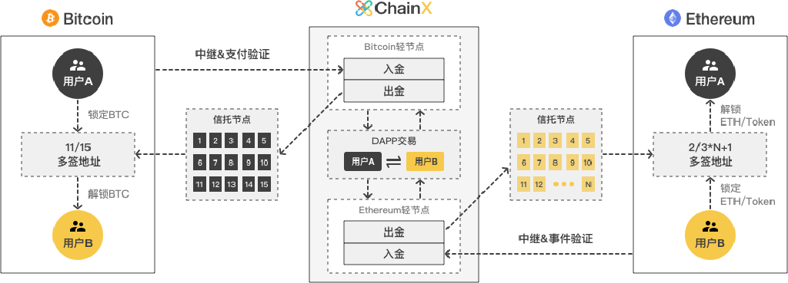

<h1 align="center">ChainX Whitepaper</h1>

2019-06-10

Inter-chain hub for digital assets

Breaking barriers among assets in different chains and creating the ecosystem of multi-currency integration

## Background

>At present, blockchain assets are trapped in their own systems without inter-chain division of work and collaboration.

BTC has established the most widely accepted consensus, but its transaction efficiency is low; ZEC has enabled privacy protection, but smart contract is not incorporated; ETH has smart contract, but it cannot migrate to the PoS system; ChainX can transfer all assets across chains in a decentralized way. Chains that have connected with ChainX can enjoy asset connectivity with all chains.

The PoW algorithm issuing new cryptocurrencies based on the mining power is considered to be a relatively decentralized and fair distribution model, but it is still prone to be monopolized by big miners, leaving ordinary users no choice but to buy mining machine at high prices. The PoS chain generally has a large private offering or setting up a fund to issue cryptocurrencies. After the launch, it only issues additional tokens to users with voting power, resulting in new users resorting to the secondary market.

The measure of PoW's mining power is computing power, One CPU One Vote. The traditional PoS mining power is measured by the amount of  PoW coins. One Coin One Vote, where Coin refers to
the stock after the initial release of Coin. PoW's CPU can continue to flood into the mining, but PoS's Coin is not generated in a consistent and fair manner, thus too many centralized factors can affect the process.

EOS is the new representative of the PoS chain. It does not adopt the one-time pre-mining method in a private offering; instead, a public ICO that lasts for one year will be launched
before the chain goes live. The EOS is generated based on the value of ETH, but when the chain is actually live, the additional issuance of new coins has been monopolized by the nodes elected by the deposit coins, thus the new ones to counterbalance the old cannot flow in, and the concept of decentralization is not achieved. There is still a bumpy road ahead before reaching decentralization and a one-year public offering is far from enough to set record straight. Bitcoin promotes free and fair competition that lasts for hundreds of years. Only by adopting that can we see a promising future.

## Overview

>ChainX' s PoS Consensus pioneers the asset mining model One Asset One Vote, which measures the mining power based on the market value of BTC, ETH, EOS and other assets from users' inter-chain deposits, and uses Bitcoin﹂ s model to gradually halve the output to distribute PCX fairly.
Users can connect all kinds of digital assets they hold with ChainX. DApp within the system exchange can meet the trading needs of these assets on the one hand, and also generate fair
value for mining market.

Polkadot is a project initiated by the Web3 Foundation and designed and developed by the Parity team led by Ethereum's former CTO, Gavin Wood. Polkadot is committed to enable communication among chains to achieve blockchain connectivity, multi-chain coexistence, and to solve the problems of scalability and diversity. Polkadot has developed a chain framework, Substrate, which enables hybrid PoS consensus, on-chain-parliament governance, Wasm virtual machine, smart contract execution, and efficient light client protocols. Many chains including Ethereum 2.0 Shasper are operating on this framework.

The Web3 Foundation and ChainX are strategic partners, which will allow ChainX to use Polkadot's PoS Consensus and Contracting Technology to build the upper-tier facilities for inter-chain assets, while Polkadot will focus on inter-chain communication and the underlying facilities. ChainX is launched first to integrate existing digital assets across the chains to warm up the Polkadot ecosystem, and when Polkadot goes live, ChainX will be able to transfer existing assets to the Polkadot network while providing various services to new assets in the Polkadot network.

ChainX will try to adopt the most decentralized light node method to integrate mainstream digital assets, including BTC, ETH, ERC20, EOS, ADA, ZEC, etc., cultivating community habits of
inter-chain asset transfer and good developer atmosphere, and incubating DApp based on the latest smart contract technology. Substrate only provides the most basic chain framework and a
great amount of improvements need to be made to achieve the above features, including multi-chain light node bridge, witness bridge, special incentive models, multi-chain asset trust tools, multi-platform wallets and blockchain browser.

## Economic system

    

> ChainX uses a model that halves the output of coins every 2 years to issue a total of 21 million PCX

20% of the first two-year issuance is distributed to the founding team for research and operation. After two years, all new issuance will be distributed to the community with the founding team only accounting for 10% of the total. Each block of Bitcoin is generated every 10 minutes, and the initial single block reward is 50BTC, halving the reward every 210,000 blocks. Each mining cycle of ChainX is 5 minutes, and the initial single-cycle reward is 50PCX, halving it every 210,000 cycles.

ChainX uses a model that halves the output every two years to issue a total of 21 million PCXs. There is no pre-mining, and all users participate fairly at the same starting point. ChainX uses the asset mining model to motivate users to participate in inter-chain deposits and staking. The higher the market value of inter-chain assets held by users, the higher the voting power of each node, and the more new PCXs can be mined each day.

For example, a user holds 1 BTC and 2 ETH in ChainX by means of inter-chain deposits or purchase, and the daily average price generated by DEX in ChainX is 1BTC=1000PCX, 1ETH=100PCX,
then the market value of inter-chain assets held by the user is 1 * 1000 + 2 * 100 = 1200PCX, which automatically splits into 600PCX's “virtual voting power” based on half of the market value. If the user has 300PCX "real voting power" on a few nodes, the user will get 300 + 600 = 900PCX's “mining power”.

Assuming that the total “mining power” of all users is 90000PCX, the user accounts for 1% of the total, and can be distributed 1% of the total daily issuance of 14400 PCX per day. The total daily issuance is halved every two years. The validator nodes and deposit referrals will receive 10% of the mining revenue of their respective users.

DOT investors can't transfer their assets on Polkadot. The assets can enter the ChainX system through inter-chain mapping. But they only have PCX mining right, thus not real DOT. To distinct it, the mining power is called Shadow DOT which will be fixed at 1SDOT: 0.1PCX. If all of the 5 million DOTs currently released are mapped to the ChainX system, there will be 500,000 PCX mining power, which is equivalent to the voting power generated by all the outputs of the entire chain for more than one month. Now the main network of ChainX starts, but only BTC and SDOT mining are supported in the early stage. Other mainstream assets will be included after new chain bridges are launched in the future.

The exchange within the system DApp supports transaction of PCX/BTC and SDOT/PCX, where BTC stands for real BTC, and there is sufficient reserve in the multi-signed address of the trustee nodes, which can support user's withdrawal at any time. The SDOT stands for the deposits mining power which equals to the mining power of 0.1 PCX in ChainX. DOT investors can prove
their investment through inter-chain mapping at any time. The asset does not need to be withdrawn, even after Polkadot goes live, it can always participate in mining.

## Consensus algorithm

ChainX will use PoS consensus algorithm to establish the largest PoS node network in history, capable of supporting 1000 consensus nodes, 2s block generation time, and less than 10s latency.

In the traditional PoW algorithm, the mining power of a single machine is very weak, not able to generate blocks independently and it has to join a mining pool or a self-built mining pool, resulting in only 10 mining pool nodes per chain. The initial PoS chain usually has about 7 nodes, and the later PoS chain has only dozens of nodes. The decentralization of the blockchain network has not been shown at all, because ordinary users cannot directly become consensus nodes, instead they have to rely on large organizations.

The number of Consensus nodes in ChainX will start from a few dozen, and will gradually grow after the community matures. In the initial stage, the cloud servers are needed to build consensus nodes. Later users only need to download the desktop wallet to generate blocks, but good internet environment and computing power are required, or punishment may be incurred if any block is delayed. The punishment funds will be transferred to the council fund and future referendums will be held to decide how to use it.

Anyone can register a node and start participating in elections after the node is installed. ChainX adopts a one-cast-one-vote model to eliminate node conspiracy. Any user can use PCX for node elections, and it is recommended to select nodes that are self-collateralized, stable in operation, and fully disclosed.

The profit model of the node is getting 10% mining revenues of the user, and the specific proportion can be modified by the follow-up referendums. Node dropout or other malicious behavior will be punished by reducing daily user rewards. The election cycle for each consensus node is one hour and nodes will be ranked according to the number of votes. If a node fails to be selected as a validator node and becomes a candidate node, heartbeat transactions also need to be initiated with a real node and empty nodes are not allowed. Votes from both consensus nodes and candidate nodes participate in the mining reward distribution, and users will enjoy the same benefit without affecting the advancement of the candidate nodes.

## Transfer bridge

    

Asset crossing chains is a process in which a user locks the asset in the original chain, maps asset onto the target chain where withdrawal is available, and finally unlocks the asset in the original chain.

Assets do not disappear in the original chain, but instead are transferred to the decentralized trust of Light Node Protocol, or to a centralized trust
managed by an individual or individuals. Asset inter-chain mapping generally has three models: witnesses, hash lock, and light node model. Witness model needs some semi-centralized trust institutions to guarantee; hash lock directly transfers asset ownership and fails in inter-chain mapping, what’ s worse, transactions may be interrupted. The most practical and secure decentralized inter-chain mapping model is the light node model. The security of inter-chain mapping is guaranteed by the consensus algorithm of the original chain, which assures the highest level of security. If the original chain cannot integrate with the light nodes of the target chain, the assets will be managed by individual or multi-signed trusts. If it can, the asset will be managed by the light node protocol on the original chain.

For chains with efficient light nodes, ChainX will use the light node protocol to complete the asset mapping to the ChainX chain. However, the existing mainstream chains generally cannot integrate with the light nodes of the ChainX chain, so users’ assets will be managed by multi-signed addresses or multi-signed contracts joint trusts.

The election cycle of trustee nodes which are ranked according to the number of votes to select the top 15 from the consensus nodes is 10 days. The trustee nodes automatically generate
two cold and hot multi-signed addresses or contracts. After each cycle, assets on the old address will be transferred to the new address.  Users can monitor the system's inter-chain asset issuance and reserves in real time, and no trustee node can be unilaterally misappropriated.

At present, we have developed the BTC light client bridge, which can completely map BTC onto ChainX in a decentralized way. ETH's light client bridge is under development. Light client bridges of other chains are also being studied, and the connection with the Polkadot eco-chain will use a two-way light client protocol, which is more efficient and does not require trustee nodes.

## Inter-chain mapping

> Inter-chain asset transfer requires a mapping relationship to be established between the user two addresses on two chains, so that the system can issue the mapped assets on the account in ChainX.

Specific inter-chain binding method:

The user needs to initiate a transfer transaction to the escrow address from his original address, and fill in the Note the address of his ChainX account. This transaction secured by the original private key signature can ensure that the user's assets are still in full control of himself after crossing chains. inter-chain binding once done, you will be able to transfer directly without having to add new Notes. If you need to change the address, you can add new Note, and the binding with the original address will be updated.

Specific to Bitcoin's inter-chain binding, the Note refers to the OP_RETURN function in the transaction; Ethereum's inter-chain binding, Data function; EOS inter-chain binding, Memo function. At present, only few Bitcoin wallets support OP_RETURN, but ChainX has developed an offline binding tool, and many Bitcoin wallets are able to add inter-chain binding tools. Ethereum wallets have perfect support for Data, and EOS supports Memo well.

The dawn of asset crossing chains has arrived, and sooner or later BTC wallets will have to enable inter-chain binding for users. In the incentive rules of ChainX, if ChainX nodes are added by a user in the Note to identify the inter-chain binding channel, the user will get 10% reward to his binding channel account when he withdraws deposits mining reward; if the user does not have a binding channel, 10% will be sent to the parliamentary fund. The final proportion will be modified by the follow-up referendums.

ChainX will arrange connection schedules with different chains according to the number of users in each chain and the light client protocol, and provide the coin services free of charge. We welcome chains with complete light client protocol to actively develop ChainX's transfer bridge and build access to the ChainX system as well as entire inter-chain ecosystem.

## Account system

In order to prevent DDOS, users need to pay transactions fees to miners, and the system will charge the corresponding fees according to the complexity of different operations. Users also have different acceleration options according to network congestion to achieve flexible control. It seems that users need to pay fees, but they can balance out by obtaining a large amount of mining revenue which is enough to meet the trading needs of non-frequent users in the early stage of network development as long as they participate in voting or own assets on the chain. And when some block is packed, the fees will be collected into the validator’s reward pool and replenished to voting users. Therefore, voting users can still use the blockchain "free" in this closed system, and most of the mining users will be profiting with only some high-frequent users needing to pay additional fees.

Traditional miner fees are criticized because they are too expensive, not for the sake of the cost, but because of the low throughput of the chain. EOS does not require miner fees, but the actual capital cost is higher, and the risk of being attacked is also higher.

ChainX currently charges a transfer transaction for only 0.0001PCX. As ChainX's performance and throughput gradually increase, the user's fee for each operation runs lower and can be ignored. In the late stage of network development, the additional issuance of chains will gradually slow down.  In the far future, the main source of user's mining revenue is from transaction fees and various types of punishment fees.

PCX is used in the following ways:

- Miner fees: Used to pay miners, similar to BTC.

- Market value unit: Used as the market capitalization unit of the asset, all assets are converted into voting power according to the price of PCX, similar to ETH/ERC20.

- Collateral: Used as collateral for trustee nodes and consensus nodes to enhance their credit, the more collateral binding to nodes, the easier it is to win user votes.

- Standard: PoS Consensus election standard, the higher the number of votes, the greater responsibility in generating blocks and safeguarding consensus, also used as collateral and voting tools for chain governance, similar to EOS.

- Exchange medium: Used as the base currency and exchange medium for certain non-mainstream assets in the system exchange DApp, similar to BNB.

## Roadmap

Polkadot consists of a relay chain and several parachains.

Parachains can be developed using different types of blockchain underlying technologies. The relay chain is responsible for the shared security consensus across the network and the inter-chain transaction of parachains. The relay chain itself does not have any applications, and applications are developed and deployed on parachains. Polkadot will push the entire blockchain world forward onto a new dimension, marching towards blockchain 3.0. Polkadot will be launched at the end of this year, focusing on the communication among new chains in the Polkadot ecosystem.  For the existing blockchains, it will build a Ethereum contract bridge to integrate Ethereum into the Polkadot network and others chains will be handled by the community in terms of integration.

### ChainX v1: Goes live before Polkadot launching

    

It will first operate as an independent chain and issue PCX, meanwhile build the transfer bridges with the current mainstream chains, and integrate inter-chain assets on chains of BTC, LTC, ZEC, ETH, ERC20, ERC721, ADA, EOS to make it more extensive, so that more users can participate in asset mining.

### ChainX v2: Goes live after Polkadot launching v1 in 2019 Q4

    

ChainX will add a new transfer bridge chain as a parallel chain of Polkadot to connect Polkadot assets and will continue to support the community in developing various DApps.

### ChainX v3: Goes live after Polkadot launching v2 in 2020

    

ChainX will evolve into a multi-chain architecture and operate as the second-layer relay network of Polkadot.

## Application ecosystem

> ChainX uses a inter-chain approach to integrate multi-chain assets so they can enjoy the same smart contract services

It expands BTC applications because BTC can only perform several transactions per second on the Bitcoin chain, but mapping it to ChainX chain, transaction throughput and response speed are greatly improved and transaction cost reduced, fulling showing its advantages as a base currency by participating in ChainX's various DApp services.

> ChainX is built on the new generation of WASM smart contract technology that enables the development and deployment of various DApps.

Currently, runtime contract development is supported, and later contract development will be supported. Developers can use any language that can be compiled into WASM, and the development support for Rust is the best in the early days. The current chain performance can reach hundreds of TPS with complete verification system. 

> The system exchange DApp will adopt a free matching model without charging any matching fee.

Traditional exchanges charge about 0.1% matching fee. Users pay a lot of fees for many transactions, which is much higher than the miner's fees on the chain. ChainX's completely decentralized community business model will not be benefiting any centralized party and truly enables it to become user's own system.

> Community developers can design different economic models and application scenarios in various upcoming applications.

For example, stablecoins backed by BTC, ZEC-based privacy payment system, and various games or high-end financial derivatives and services.
