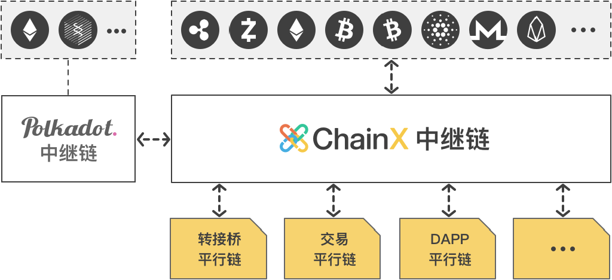

<h1 align="center">ChainX Whitepaper</h1>

2019-06-10

Inter-chain hub for digital assets

Breaking barriers among assets in different chains and creating the ecosystem of multi-currency integration

## Background

>At present, blockchain assets are trapped in their own systems without inter-chain division of work and collaboration.

BTC has established the most widely accepted consensus, but its transaction efficiency is low; ZEC has enabled privacy protection, but smart contract is not incorporated; ETH has smart contract, but it cannot migrate to the PoS system; ChainX can transfer all assets across chains in a decentralized way. Chains that have connected with ChainX can enjoy asset connectivity with all chains.

The PoW algorithm issuing new cryptocurrencies based on the mining power is considered to be a relatively decentralized and fair distribution model, but it is still prone to be monopolized by big miners, leaving ordinary users no choice but to buy mining machine at high prices. The PoS chain generally has a large private offering or setting up a fund to issue cryptocurrencies. After the launch, it only issues additional tokens to users with voting power, resulting in new users resorting to the secondary market.

The measure of PoW's mining power is computing power, One CPU One Vote. The traditional PoS mining power is measured by the amount of  PoW coins. One Coin One Vote, where Coin refers to
the stock after the initial release of Coin. PoW's CPU can continue to flood into the mining, but PoS's Coin is not generated in a consistent and fair manner, thus too many centralized factors can affect the process.

EOS is the new representative of the PoS chain. It does not adopt the one-time pre-mining method in a private offering; instead, a public ICO that lasts for one year will be launched
before the chain goes live. The EOS is generated based on the value of ETH, but when the chain is actually live, the additional issuance of new coins has been monopolized by the nodes elected by the deposit coins, thus the new ones to counterbalance the old cannot flow in, and the concept of decentralization is not achieved. There is still a bumpy road ahead before reaching decentralization and a one-year public offering is far from enough to set record straight. Bitcoin promotes free and fair competition that lasts for hundreds of years. Only by adopting that can we see a promising future.

## Overview

>ChainX' s PoS Consensus pioneers the asset mining model One Asset One Vote, which measures the mining power based on the market value of BTC, ETH, EOS and other assets from users' inter-chain deposits, and uses Bitcoin﹂ s model to gradually halve the output to distribute PCX fairly.
Users can connect all kinds of digital assets they hold with ChainX. DApp within the system exchange can meet the trading needs of these assets on the one hand, and also generate fair
value for mining market.

Polkadot is a project initiated by the Web3 Foundation and designed and developed by the Parity team led by Ethereum's former CTO, Gavin Wood. Polkadot is committed to enable communication among chains to achieve blockchain connectivity, multi-chain coexistence, and to solve the problems of scalability and diversity. Polkadot has developed a chain framework, Substrate, which enables hybrid PoS consensus, on-chain-parliament governance, Wasm virtual machine, smart contract execution, and efficient light client protocols. Many chains including Ethereum 2.0 Shasper are operating on this framework.

The Web3 Foundation and ChainX are strategic partners, which will allow ChainX to use Polkadot's PoS Consensus and Contracting Technology to build the upper-tier facilities for inter-chain assets, while Polkadot will focus on inter-chain communication and the underlying facilities. ChainX is launched first to integrate existing digital assets across the chains to warm up the Polkadot ecosystem, and when Polkadot goes live, ChainX will be able to transfer existing assets to the Polkadot network while providing various services to new assets in the Polkadot network.

ChainX will try to adopt the most decentralized light node method to integrate mainstream digital assets, including BTC, ETH, ERC20, EOS, ADA, ZEC, etc., cultivating community habits of
inter-chain asset transfer and good developer atmosphere, and incubating DApp based on the latest smart contract technology. Substrate only provides the most basic chain framework and a
great amount of improvements need to be made to achieve the above features, including multi-chain light node bridge, witness bridge, special incentive models, multi-chain asset trust tools, multi-platform wallets and blockchain browser.

## Economic system

#### Issuance model

ChainX will issue cryptocurrency PCX (P stands for Polkadot), with a total of 21 million and the amount released halved every two years. 20% of the issuance in the first two years is distributed to the founding team for ongoing development. After two years, all new issuance will be distributed to the community.

    

#### Asset mining

All participants of the asset mining compete against each other with PCX as the unit to calculate the computing power which is divided into virtual computing power: inter-chain mining and real computing power: voting mining.

- Inter-chain mining refers to all kinds of assets outside the chain like BTC and ETH that users transfer into the system through depositing, mapping or locking-up, are automatically converted into virtual PCX inter-chain mining power according to the price of the asset and the discount given to each asset. Every inter-chain asset has a different discount rate which could be adjusted through community voting. The reason why assets are discounted in value entering the chain is because PCX, as the system's internal currency, should enjoy greater mining power than other inter-chain assets to encourage users to hold more PCX.

- Voting mining means users that hold real PCX participate in the election of the PoS system and manually vote for certain nodes.

The total mining power of a user is equal to the inter-chain mining power of virtual PCX plus the voting power of the real PCX. For example, one user deposits one BTC, two ETHs into ChainX, and holds 700 PCXs among which 300 PCXs participate in the election and 400 PCXs do not. At the time, the exchange price in ChainX stands at 1BTC: 10000PCX, 1ETH: 1000PCX, and the user will automatically obtain the mining power of (1 * 10000 + 2 * 1000) * 10% + 300 = 1500PCX. All users have access to PCX mining revenue in each reward cycle according to the mining power they have. Users can use the PCX obtained through revenue to participate in elections or wait for the value of the inter-chain assets to go up to claim more mining power.

Although extra-chain assets held by users can gain equal right to mining, the market value of these assets is constantly fluctuating and only the number of PCX generated by mining stands stable, so only PCX can be used as the benchmark for node election and chain governance.

#### Dynamic mining

ChainX as a PoS system, its security depends on the PCX collateralized by users. The more PCX pledged as collaterals, the more secure the system is. Meanwhile ChainX is also committed to becoming an inter-chain asset gateway with an aim to attract more inter-chain assets. The more assets it attracts, the higher the value stays.

However, both the internal asset and inter-chain assets participate in asset mining, so the two are interdependent and competing. In order to avoid the impact of sudden influx of inter-chain assets in the beginning, the dynamic mining model is adopted. When inter-chain assets grow too fast, the system deploys a fixed dividend ratio for the two kinds of assets.

The current ratio of inter-chain assets to PCX voting and mining power is 1:1, which can be adjusted by community voting, that is, the upper limit of mining power of all inter-chain assets is set to 50%, to ensure PCX voting mining power is equal to or more than 50%, so that at least half of PCX will be issued to PCX holders every day.

##### Symbol Table

symbol                    | meaning
:--                       | :--
Powertotal     | Total mining power
Powerreal      | Total real mining power
Powervirtual   | Total virtual mining power
Rtotal         | Total issuance of each dividend cycle for all computing power
Rreal          | Total amount of PCX obtained by the real computing power in each dividend cycle
Rvirtual       | Total amount of PCX obtained by the virtual computing power in each dividend cycle
Staked                    | Total number of PCX participating in the voting
c                         | An inter-chain asset, c ∈ { X-BTC, L-BTC, S-DOT, ... }
Powerc         | Total virtual computing power of the inter-chain asset c
Amountc        | Total amount of the inter-chain asset c,
Pricec         | Price of unit inter-chain asset c for PCX
Discountc      | Initial discount rate of the inter-chain asset c
UbiquitousDiscount        | Dynamic competitive discount rates for all inter-chain assets
FinalDiscountc | Final computing power discount for the inter-chain asset c

##### Calculation formula of computing power

- The total computing power is equal to the real computing power plus the virtual computing power:

 Powertotal = Powerreal + Powervirtual

- The total real computing power is equal to the total number of votes:

    Powerreal = Staked

- The total virtual computing power is the sum of the virtual computing power of all inter-chain assets:

    Powervirtual = sum ( Powerc ), c ∈ { X-BTC, L-BTC, S-DOT, ... }

- The virtual power of the inter-chain asset c is equal to the market value of the asset in PCX multiplied by the initial mining discount rate:

    Powerc = Amountc * Pricec * Discountc

   For c ∈ { X-BTC, L-BTC }:

    - Price X-BTC  is based on the average trading price of the last hour in DEX on the chain

    - Discount X-BTC  is currently 10%

    - L-BTC has no trading pairs, and the current computing power is the same as X-BTC.

   For c ∈ { S-DOT }:

    - Price S-DOT  is fixed at 0.1PCX

    - Discount S-DOT  is 10%。

- Distribution of issuance to the total computing power for each dividend cycle:

    Rtotal = Rreal + Rvirtual

- The final power discount of the inter-chain asset c based on its market value:

    FinalDiscountc = Discountc * UbiquitousDiscount

##### Dynamic power competition

The current mining upper limit of all inter-chain assets is 50%, Powervirtual : Powerreal = 1:1. If Powervirtual > Powerreal, the upper limit mining rule takes effect.

- When Powervirtual <= Powerreal,

    - Rreal    = Powerreal / Powertotal * Rtotal

    - Rvirtual = Powervirtual / Powertotal * Rtotal

    - UbiquitousDiscount = 1

- When Powervirtual > Powerreal,

    - Rreal     = 1/(1+1) * Rtotal = 50% * Rtotal

    - Rvirtual = 1/(1+1) * Rtotal = 50% * Rtotal

    - UbiquitousDiscount = Powerreal / Powervirtual

After dynamically calculating the total rewards of both inter-chain assets and voting assets, the rewards of each individual node are calculated according to the ratio of real and virtual nodes, and then individual user‘s revenue is calculated according to their voting age. When the total number of inter-chain assets surges to the upper limit, an additional discount rate on all assets will be applied with different discount rates for each asset also in place.

ChainX main network was officially launched on May 25, 2019, currently supporting BTC deposits(X-BTC), lock-up mining (L-BTC) and DOT mapping mining (S-DOT). Other mainstream assets will be taken onboard when transfer bridges are ready.

DOT investors can't transfer their assets on Polkadot. Assets that enter the ChainX system by inter-chain mapping only have PCX mining right and are not real DOT. To distinguish, it is called S-DOT. Similarly, L-BTC which enters the system through lock-up also only has mining right and cannot be transferred.

The decentralized exchange DApp has trading pairs PCX/X-BTC and S-DOT/PCX, where X-BTC stands for true BTC which has enough reserves in the multi-signed trust nodes for withdrawal at any time. SDOT represents the estimated value of DOT before DOT goes live, and the power of inter-chain mining within ChainX. DOT investors can show their investment through inter-chain mapping at any time. The asset does not need to be withdrawn, and it can participate in mining before Polkadot goes live.

## Consensus algorithm

ChainX will use PoS consensus algorithm to establish the largest PoS node network in history, capable of supporting 1000 consensus nodes, 2s block generation time, and less than 10s latency.

In the traditional PoW algorithm, the mining power of a single machine is very weak, not able to generate blocks independently and it has to join a mining pool or a self-built mining pool, resulting in only 10 mining pool nodes per chain. The initial PoS chain usually has about 7 nodes, and the later PoS chain has only dozens of nodes. The decentralization of the blockchain network has not been shown at all, because ordinary users cannot directly become consensus nodes, instead they have to rely on large organizations.

The number of Consensus nodes in ChainX will start from a few dozen, and will gradually grow after the community matures. In the initial stage, the cloud servers are needed to build consensus nodes. Later users only need to download the desktop wallet to generate blocks, but good internet environment and computing power are required, or punishment may be incurred if any block is delayed. The punishment funds will be transferred to the council fund and future referendums will be held to decide how to use it.

Anyone can register a node and start participating in elections after the node is installed. ChainX adopts a one-cast-one-vote model to eliminate node conspiracy. Any user can use PCX for node elections, and it is recommended to select nodes that are self-collateralized, stable in operation, and fully disclosed.

The profit model of the node is getting 10% mining revenues of the user, and the specific proportion can be modified by the follow-up referendums. Node dropout or other malicious behavior will be punished by reducing daily user rewards. The election cycle for each consensus node is one hour and nodes will be ranked according to the number of votes. If a node fails to be selected as a validator node and becomes a candidate node, heartbeat transactions also need to be initiated with a real node and empty nodes are not allowed. Votes from both consensus nodes and candidate nodes participate in the mining reward distribution, and users will enjoy the same benefit without affecting the advancement of the candidate nodes.

## Transfer bridge

    

Asset crossing chains is a process in which a user locks the asset in the original chain, maps asset onto the target chain where withdrawal is available, and finally unlocks the asset in the original chain.

Assets do not disappear in the original chain, but instead are transferred to the decentralized trust of Light Node Protocol, or to a centralized trust
managed by an individual or individuals. Asset inter-chain mapping generally has three models: witnesses, hash lock, and light node model. Witness model needs some semi-centralized trust institutions to guarantee; hash lock directly transfers asset ownership and fails in inter-chain mapping, what’ s worse, transactions may be interrupted. The most practical and secure decentralized inter-chain mapping model is the light node model. The security of inter-chain mapping is guaranteed by the consensus algorithm of the original chain, which assures the highest level of security. If the original chain cannot integrate with the light nodes of the target chain, the assets will be managed by individual or multi-signed trusts. If it can, the asset will be managed by the light node protocol on the original chain.

For chains with efficient light nodes, ChainX will deploy the light node protocol to facilitate asset mapping onto the ChainX chain. However, the existing mainstream chains generally cannot integrate the light nodes of ChainX, so assets on these chains have to be managed through multi-signed addresses or multi-contract joint custodian. The initial trust nodes are selected from nodes that are considered excellent while participating in the ChainX testing network. Abdication system is applied to appoint following trust nodes and the process is jointly decided and executed by the parliament and the previous trust nodes. Each trust node shall generate two multi-signed addresses or contracts, hot and cold. After each change, assets in the old address will be transferred to the new one. Users can monitor the system's inter-chain asset issuance and reserves in real time, and no trust node can unilaterally misappropriate the assets.

The election cycle of trustee nodes which are ranked according to the number of votes to select the top 15 from the consensus nodes is 10 days. The trustee nodes automatically generate
two cold and hot multi-signed addresses or contracts. After each cycle, assets on the old address will be transferred to the new address.  Users can monitor the system's inter-chain asset issuance and reserves in real time, and no trustee node can be unilaterally misappropriated.

At present, we have developed BTC's light node bridge, which can map BTC into ChainX in a completely decentralized way. The light node bridge of ETH is under development as well as other light bridges. The connection with the Polkadot ecosystem will adopt a two-way light node protocol, which is more efficient and does not need trust node.

## Inter-chain mapping

> Inter-chain asset transfer requires a mapping relationship to be established between the user two addresses on two chains, so that the system can issue the mapped assets on the account in ChainX.

Specific inter-chain binding method:

The user needs to initiate a transfer transaction to the escrow address from his original address, and fill in the Note the address of his ChainX account. This transaction secured by the original private key signature can ensure that the user's assets are still in full control of himself after crossing chains. inter-chain binding once done, you will be able to transfer directly without having to add new Notes. If you need to change the address, you can add new Note, and the binding with the original address will be updated.

Specific to Bitcoin's inter-chain binding, the Note refers to the OP_RETURN function in the transaction; Ethereum's inter-chain binding, Data function; EOS inter-chain binding, Memo function. At present, only few Bitcoin wallets support OP_RETURN, but ChainX has developed an offline binding tool, and many Bitcoin wallets are able to add inter-chain binding tools. Ethereum wallets have perfect support for Data, and EOS supports Memo well.

The dawn of asset crossing chains has arrived, and sooner or later BTC wallets will have to enable inter-chain binding for users. In the incentive rules of ChainX, if ChainX nodes are added by a user in the Note to identify the inter-chain binding channel, the user will get 10% reward to his binding channel account when he withdraws deposits mining reward; if the user does not have a binding channel, 10% will be sent to the parliamentary fund. The final proportion will be modified by the follow-up referendums.

ChainX will arrange connection schedules with different chains according to the number of users in each chain and the light client protocol, and provide the coin services free of charge. We welcome chains with complete light client protocol to actively develop ChainX's transfer bridge and build access to the ChainX system as well as entire inter-chain ecosystem.

## Account system

In order to prevent DDOS, users need to pay transactions fees to miners, and the system will charge the corresponding fees according to the complexity of different operations. Users also have different acceleration options according to network congestion to achieve flexible control. It seems that users need to pay fees, but they can balance out by obtaining a large amount of mining revenue which is enough to meet the trading needs of non-frequent users in the early stage of network development as long as they participate in voting or own assets on the chain. And when some block is packed, the fees will be collected into the validator’s reward pool and replenished to voting users. Therefore, voting users can still use the blockchain "free" in this closed system, and most of the mining users will be profiting with only some high-frequent users needing to pay additional fees.

Traditional miner fees are criticized because they are too expensive, not for the sake of the cost, but because of the low throughput of the chain. EOS does not require miner fees, but the actual capital cost is higher, and the risk of being attacked is also higher.

ChainX currently charges only 0.0001PCX as transaction fee. As ChainX's performance and throughput gradually improves, the fee for each transaction can be neglected. In the late stage of development, the chain's additional issuance will gradually slow down and the main source of users’ mining revenue is all sorts of service fees and various types of punishment fines.

PCX is used in the following ways:

- Miner fees: Used to pay miners, similar to BTC.

- Market value unit: Used as the market capitalization unit of the asset, all assets are converted into voting power according to the price of PCX, similar to ETH/ERC20.

- Collateral: Used as collateral for trustee nodes and consensus nodes to enhance their credit, the more collateral binding to nodes, the easier it is to win user votes.

- Standard: PoS Consensus election standard, the higher the number of votes, the greater responsibility in generating blocks and safeguarding consensus, also used as collateral and voting tools for chain governance, similar to EOS.

- Exchange medium: Used as the base currency and exchange medium for certain non-mainstream assets in the system exchange DApp, similar to BNB.

## Community governance

In order to promote the decentralized governance of the community, the ChainX parliament will be expanded to include nodes that are considered matured. One seat is reserved for the PolkaX team for the role it plays in developing and upgrading the system. Another 10 seats will be added. The 10 new seats will be held by credible nodes with intention to run for the parliament, that have secured the top 10 spots in terms of votes. Nodes that intent on bribing their way through the election will be disqualified.

Given the fact that the total number of votes a node receives changes all the time, but the parliament seats should be held by a fixed group for a certain period of time, so each parliament term only lasts one month. After one month, elections will be held to select new nodes with high ratings and credibility. All 11 members of the parliament can submit any proposals to the parliament based on the information they glean from the community. The proposal is voted by members of the parliament with one member, one vote. If more than half of the members agree (more than or equal to 6), the proposal is approved in the preliminary vote. After the preliminary vote comes the referendum. The proposal needs to receive more than 2/3 of all the votes(more than or equal to 66.67%) to pass, and then the PolkaX team will implement it. For more information on the community referendum: https://scan.chainx.org/referendum/underway .

Bribery and kickbacks seriously undermine voting credibility, allowing ill-intended nodes to wreak havoc, what’s worse, winning the parliamentary seats through improper means will seriously damage the overall interests of the community. Therefore, the parliamentary fund has set up the anti-bribery and anti-fishing rewards pool with clear-cut rules: no rebates. Community users can anonymously submit screenshots or transfer records of bribery and rebates of a certain node. If more than half of the parliament members validate the evidence (more than or equal to 6), the node is disqualified for the next election, and the whistleblowers will be rewarded. In addition, the parliament maintains discretion over the collaterals of the bribery node. Nodes claiming not to participate in the parliamentary elections are not in the purview of reporting, but we still hope that all nodes adhere to fair and open election rules, optimizing the community by votings based on contribution, rather than vicious competition for short-sighted rebates.

## Roadmap

Polkadot consists of a relay chain and several parachains.

Parachains can be developed using different types of blockchain underlying technologies. The relay chain is responsible for the shared security consensus across the network and the inter-chain transaction of parachains. The relay chain itself does not have any applications, and applications are developed and deployed on parachains. Polkadot will push the entire blockchain world forward onto a new dimension, marching towards blockchain 3.0. Polkadot will be launched at the end of this year, focusing on the communication among new chains in the Polkadot ecosystem.  For the existing blockchains, it will build a Ethereum contract bridge to integrate Ethereum into the Polkadot network and others chains will be handled by the community in terms of integration.

### ChainX v1: Goes live before Polkadot launching

    

It will first operate as an independent chain and issue PCX, meanwhile build the transfer bridges with the current mainstream chains, and integrate inter-chain assets on chains of BTC, LTC, ZEC, ETH, ERC20, ERC721, ADA, EOS to make it more extensive, so that more users can participate in asset mining.

### ChainX v2: Goes live after Polkadot launching v1 in 2019 Q4

    

ChainX will add a new transfer bridge chain as a parallel chain of Polkadot to connect Polkadot assets and will continue to support the community in developing various DApps.

### ChainX v3: Goes live after Polkadot launching v2 in 2020

    

ChainX will evolve into a multi-chain architecture and operate as the second-layer relay network of Polkadot.

## Application ecosystem

> ChainX uses a inter-chain approach to integrate multi-chain assets so they can enjoy the same smart contract services

It expands BTC applications because BTC can only perform several transactions per second on the Bitcoin chain, but mapping it to ChainX chain, transaction throughput and response speed are greatly improved and transaction cost reduced, fulling showing its advantages as a base currency by participating in ChainX's various DApp services.

> ChainX is built on the new generation of WASM smart contract technology that enables the development and deployment of various DApps.

Currently, runtime contract development is supported, and later contract development will be supported. Developers can use any language that can be compiled into WASM, and the development support for Rust is the best in the early days. The current chain performance can reach hundreds of TPS with complete verification system.

> The system exchange DApp will adopt a free matching model without charging any matching fee.

Traditional exchanges charge about 0.1% matching fee. Users pay a lot of fees for many transactions, which is much higher than the miner's fees on the chain. ChainX's completely decentralized community business model will not be benefiting any centralized party and truly enables it to become user's own system.

> Community developers can design different economic models and application scenarios in various upcoming applications.

For example, stablecoins backed by BTC, ZEC-based privacy payment system, and various games or high-end financial derivatives and services.
